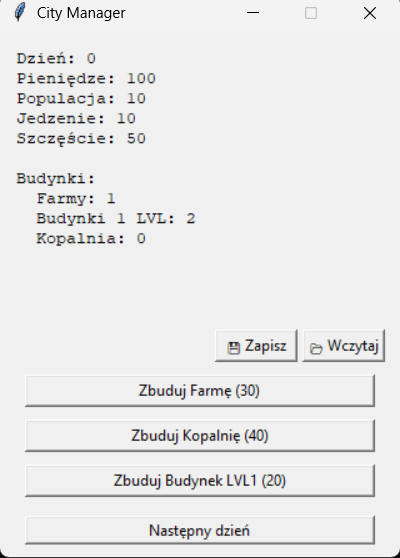
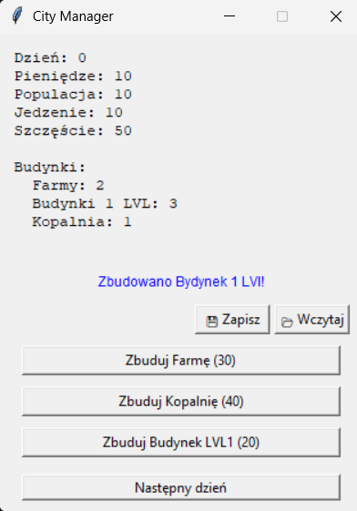
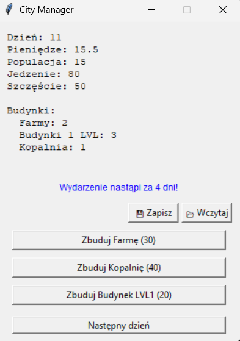
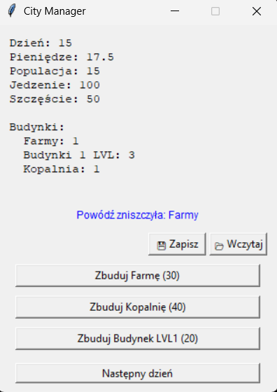
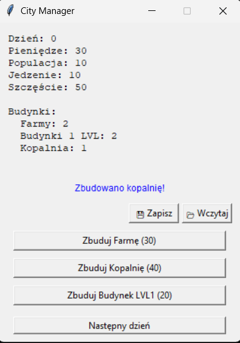
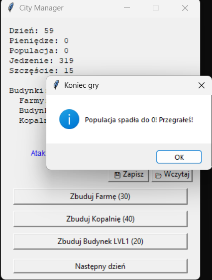
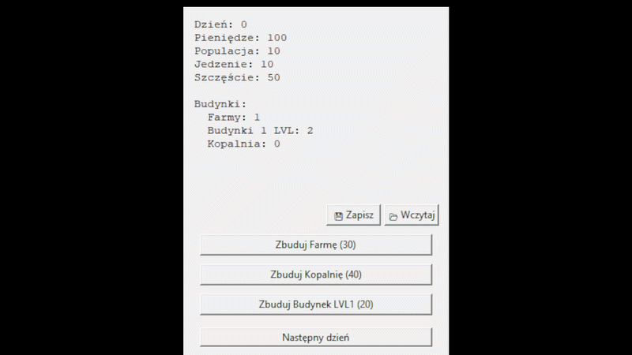

# 🏙️ City Manager

Tekstowo-graficzna gra-menedżer miasta napisana w Pythonie z interfejsem graficznym w Tkinter. Zarządzaj zasobami, buduj budynki i przetrwaj losowe katastrofy.

---

## 📋 Opis

City Manager to turowa gra strategiczna, w której gracz zarządza niewielkim miastem. Każdego dnia trzeba pilnować bilansu jedzenia, pieniędzy, populacji i szczęścia mieszkańców. Budowa nowych obiektów pozwala rozwijać miasto, ale losowe wydarzenia mogą zniweczyć wszystkie plany.

---

## 🚀 Uruchomienie

### Wymagania

- Python 3.x
- Standardowa biblioteka Pythona (tkinter, json, random — dodatkowa instalacja nie jest wymagana)

### Instalacja i uruchomienie

```bash
# Sklonuj lub pobierz projekt
git clone https://github.com/davyd-khkous/CityManager_build1.git
cd CityManager_build1

# Uruchom grę
python control.py
```

---

## 🗂️ Struktura projektu

| Plik | Opis |
|------|------|
| `control.py` | Główny plik — GUI w Tkinter, punkt wejścia |
| `main.py` | Logika jednego dnia gry |
| `city.py` | Inicjalizacja i wyświetlanie stanu miasta |
| `processes.py` | Procesy gry: produkcja, budowa, aktualizacje |
| `wydarzenia.py` | System losowych wydarzeń |
| `zachowanie.py` | Zapis i wczytywanie gry (JSON) |

---

## 🎮 Rozgrywka

### Stan początkowy miasta

| Parametr | Wartość |
|----------|---------|
| Dzień | 0 |
| Pieniądze | 100 |
| Populacja | 10 |
| Jedzenie | 10 |
| Szczęście | 50 |
| Farmy | 1 |
| Budynki poz. 1 | 2 |
| Kopalnie | 0 |

### Przyciski sterowania

- **Następny dzień** — przejście do kolejnej tury
- **Zbuduj farmę (30)** — wydaje 30 monet, dodaje farmę
- **Zbuduj kopalnię (40)** — wydaje 40 monet, dodaje kopalnię
- **Zbuduj budynek poz.1 (20)** — wydaje 20 monet, dodaje budynek mieszkalny
- **Zapisz 💾** — zapisuje bieżący postęp do pliku JSON
- **Wczytaj 📂** — wczytuje wcześniej zapisaną grę
- **Wyjście** — zamyka grę

---

## ⚙️ Mechanika gry

### Każdego dnia:

1. **Produkcja jedzenia** — każda farma produkuje +10 jedzenia
2. **Zużycie jedzenia** — każdy mieszkaniec zjada 1 jednostkę jedzenia
3. **Aktualizacja szczęścia** — spada przy braku jedzenia (-5) lub przeludnieniu (-2.5)
4. **Wzrost / spadek populacji** — zależy od szczęścia, jedzenia i wolnych miejsc
5. **Dochód z kopalń** — każda kopalnia przynosi +0.5 monety dziennie

### Budynki

| Budynek | Koszt | Efekt |
|---------|-------|-------|
| Farma | 30 monet | +10 jedzenia dziennie |
| Budynek poz.1 | 20 monet | +5 miejsc dla mieszkańców |
| Kopalnia | 40 monet | +0.5 monety dziennie |

### Populacja

- Rośnie, jeśli szczęście > 80 **lub** jedzenia jest wystarczająco dużo z zapasem (≥ populacja + 5), i są wolne miejsca
- Maleje, jeśli szczęście < 30 **lub** skończyło się jedzenie

### Szczęście

- Minimum: 0, maksimum: 100
- Spada przy braku jedzenia i przeludnieniu miasta

---

## 🌪️ Losowe wydarzenia

Co 7–21 dni dochodzi do jednego z trzech wydarzeń. Na 5 dni przed wydarzeniem pojawia się ostrzeżenie.

| Wydarzenie | Efekt |
|------------|-------|
| 🌵 Susza | -20 jedzenia |
| 🌊 Powódź | Niszczy jeden losowy budynek |
| ⚔️ Atak | -20 populacji, -30 monet |

---

## 💾 Zapis i wczytywanie

Gra zapisywana jest w formacie JSON. Zapis zawiera pełny stan miasta oraz aktualnie zaplanowane wydarzenie. Do zapisu/wczytywania używane jest standardowe okno wyboru pliku.

---

## ☠️ Warunki porażki

Gra kończy się przegraną, jeśli:
- Populacja spadnie do **0**
- Szczęście spadnie do **0**

---

## 🖼️ Galeria

| Ekran startowy | Budowa budynku |
|---|---|
|  |  |

| Ostrzeżenie o wydarzeniu | Powódź |
|---|---|
|  |  |

| Budowa kopalni | Koniec gry |
|---|---|
|  |  |

---

## 🎬 Demo


---

## 📝 Uwagi

- Konsolowe wypisywanie stanu miasta jest aktywne w celach debugowania (funkcja `pokaz_miasto` w `city.py`)
- Interfejs nie jest skalowalny (stały rozmiar okna 320×420)
- Wydajność kopalni jest niska — zaleca się budowę kilku

---

## 📄 Licencja

MIT — see [LICENSE](LICENSE).

---
